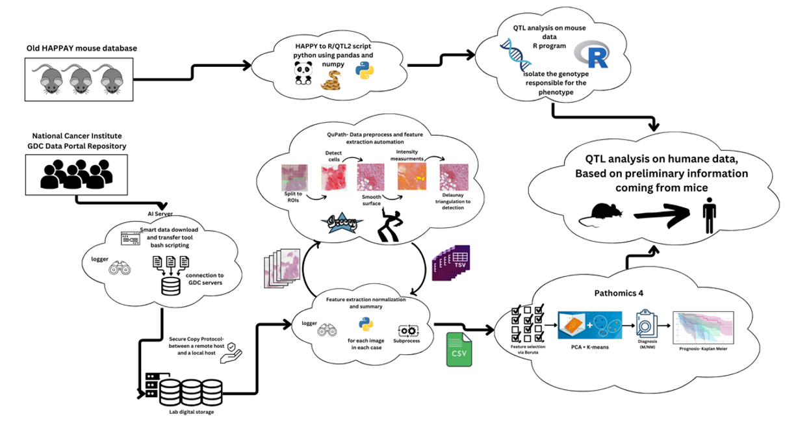
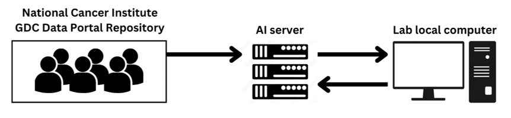

# Multi-Omics 4

### Overview
The Multi-Omics 4 project is an integrated computational pipeline designed to analyze multi-omics data for cancer research, particularly breast cancer. The project evolved to develop a robust pipeline that addresses reproducibility challenges by integrating genomics, histopathology image processing, and quantitative trait locus (QTL) analysis.
### Flow structure
1. **Data Acquisition (SDMT)**: Automates download and preprocesses datasets.
2. **Image Processing (CIP)**: Runs QuPath image analysis with optimized parameters for high accuracy in nucleus detection.
3. **QTL Analysis**: Combines phenotype and genotype data for genetic analysis, leveraging R/qtl2 for robust results.



### Repository Structure
- **Docs/**: Documentation files and user guides.
- **QTL/**: Scripts and data for QTL analysis, using R/qtl2 to handle genetic data.
- **QuPath/**: Contains scripts, configuration files, and tools for image processing experiments in QuPath.
- **SDMT/**: Smart Data Management Tool (SDMT) to manage data downloads and preprocessing.
- **parameters_check/**: Scripts for verifying and optimizing image processing parameters.
- **qupath_mouse_POC/**: Proof of concept files for applying QuPath to mouse models.
- **README.md**: This file, explaining project setup, structure, and usage.

### Short Theoretical Background
The project combines three main modules:
1. **Smart Data Management Tool (SDMT)**: Handles automated data downloads, secure storage, and preprocessing.
2. **Computational Image Processing (CIP)**: Uses QuPath to analyze histopathological images, with automation and parameter optimization for high-throughput and accuracy.
3. **Quantitative Trait Locus (QTL) Analysis**: Integrates CIP outputs with genetic data using R/qtl2, allowing in-depth analysis of genotype-phenotype relationships.

These components work together to provide a comprehensive pipeline for cancer data analysis, capable of handling large datasets and producing reliable, reproducible results.

### Technical Setup

#### Prerequisites
1. **System Requirements**: 
   - Linux (Ubuntu 20.04 or later recommended)
   - Python 3.10
   - Java 8+ (for running QuPath) (can download groovy extention from vscode)
   - R 4.0+ with the R/qtl2 package

2. **Dependencies (WIP)**:
   - Python libraries: `pip install -r requirements.txt` (see `requirements.txt` for full list)
   - QuPath (included in `QuPath/QuPath-v0.5.1-Linux`)
   - gdc-client (included in `SDMT/gdc-client_v1.6.1_Ubuntu_x64/gdc-client`)

#### Installation
1. Clone the repository:
   ```bash
   git clone https://github.com/yourusername/MultiOmics4.git
   cd MultiOmics4
   ```
2. Set up a virtual environment and activate it:
   ```bash
   python3 -m venv env
   source env/bin/activate
   ```
3. Install Python dependencies (WIP):
   ```bash
   pip install -r requirements.txt
   ```
4. Install R/qtl2 in R (WIP):
   ```R
   install.packages("qtl2")
   ```

### Data Preparation and Download
The SDMT is responsible for managing data downloads from public repositories and secure storage. Use the provided shell script to initiate the download:

```bash
cd SDMT
bash gdc_download_runtime.sh
```

This script leverages the GDC client to securely download image and genetic data to the `data_from_gdc/` directory.
Note that the paths are hardcoded and needs to be defiend as relative ones as in this Github.

### Running the Pipeline

#### 1. Smart Data Management Tool (SDMT) Workflow
The SDMT module automates data retrieval and preprocessing.
- **Flow**: Initiate data download, preprocess data files, and organize them in a structured format.
- **Configuration**: Configure data paths in `SDMT/config.yaml`.
- **Execution**:
   ```bash
   bash gdc_download_runtime.sh
   ```



#### 2. Computational Image Processing (CIP) Workflow
The CIP module processes histopathological images with QuPath, including nucleus detection, feature extraction, and intensity measurement.

- **Step 1: Parameter Optimization** - Run experiments to determine optimal parameters for nucleus detection.
   ```bash
   python3.10 QuPath/nucleus_detection_mgr.py --outdir <desired output directory> --input_image_dir <input image directory> --image_type <image format (svs/tiff/scn/png etc)> --nucleus_detection_automation QuPath/nucleus_detection_automation.groovy --qupath_parameters_config QuPath/qupath_parameters.json --qupath_console_path QuPath/QuPath-v0.5.1-Linux/QuPath/bin/QuPath
   ```


#### 3. QTL Analysis Workflow
The QTL module integrates phenotypic data from CIP with genetic data to perform QTL analysis using R/qtl2.

- **Step 1: Data Conversion** - Convert genetic data from HAPPY format to R/qtl2-compatible format using `happy_to_R2.py`.
   ```bash
   python QTL/happy_to_R2.py
   ```

- **Step 2: Run QTL Analysis** - In R, load the converted data and perform QTL analysis.
   ```R
   source("QTL/qtl_analysis_script.R")
   ```


### Configuration Files
- **qupath_parameters.json**: Defines QuPath parameters for image processing, such as detection thresholds and nucleus segmentation details.
- **config.yaml**: Located in `SDMT/`, this file configures data paths and download parameters.

### Contributors
- **Students**: Dor Fried, Lior Segal
- **Mentor**: Prof. Ilan Tsarfaty, Faculty of Medical and Health Sciences, Tel Aviv University
